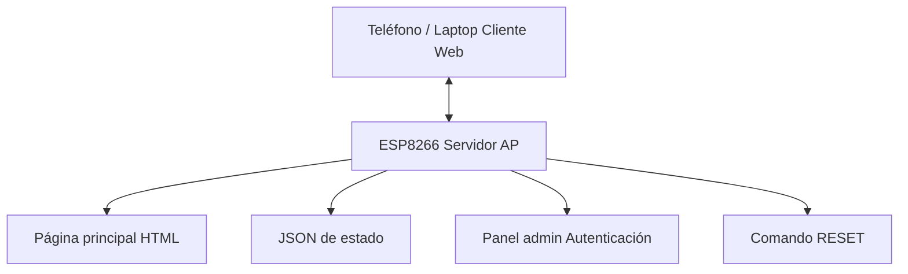
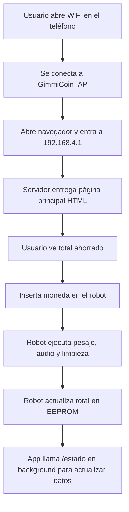
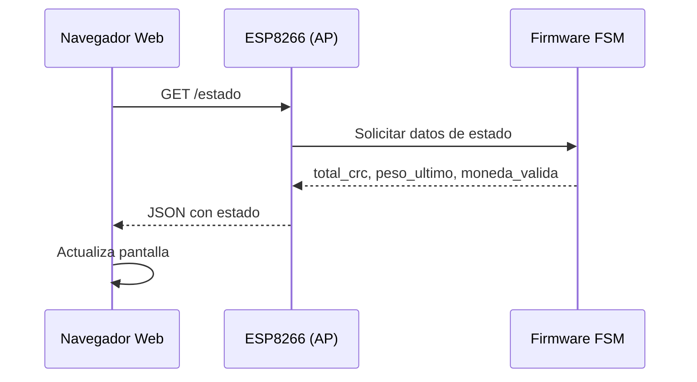
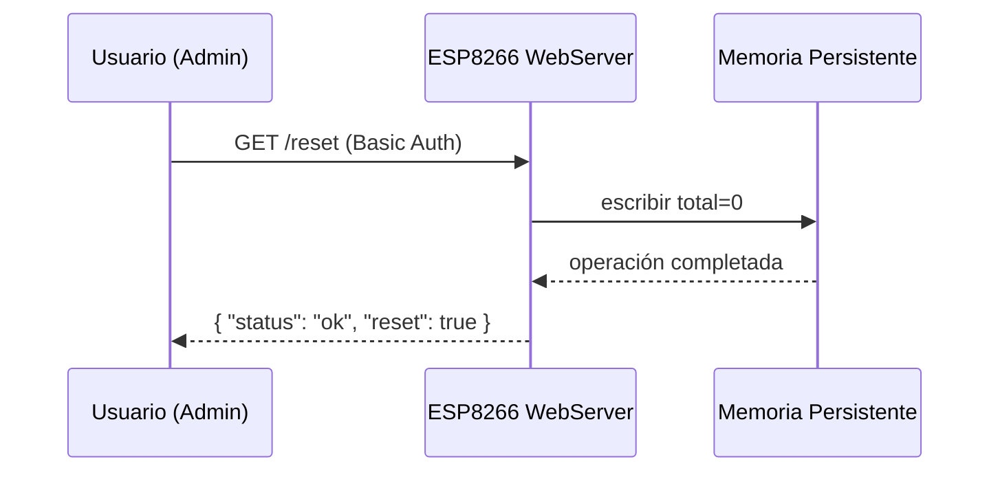

# Aplicación de Usuario y Comunicación – GimmiCoin

## 1. Introducción

La aplicación de usuario de **GimmiCoin** permite visualizar el total ahorrado, el estado del sistema y ejecutar funciones administrativas como el reinicio del contador.  
La aplicación está construida como una **web-app embebida** dentro del microcontrolador **ESP8266**, la cual es servida a los usuarios a través de WiFi en modo **Access Point**.

---

## 2. Arquitectura General de la Aplicación

La arquitectura de comunicación sigue un modelo **cliente–servidor**, donde:

- El **ESP8266** actúa como:
  - Access Point (AP)
  - Servidor HTTP
  - Proveedor de la web-app
- El **usuario** accede desde:
  - Navegador móvil (Android/iOS)
  - Navegador en laptop

Diagrama de bloques:



La app no requiere Internet: todo funciona dentro del AP generado por el robot.

---

## 3. Conexión y Topología de Red

### 3.1 Access Point

El ESP8266 crea automáticamente una red:

- **SSID:** `GimmiCoin_AP`
- **Password:** `12345678`
- **IP del robot:** `192.168.4.1`

El usuario solo debe conectarse y abrir en el navegador:

```

[http://192.168.4.1/](http://192.168.4.1/)

```

---

## 4. Interfaces de Usuario (Front-End)

La aplicación está pensada para ser una **web-app móvil** simple, rápida y ligera.

### 4.1 Página principal (`/`)

- Muestra:
  - Total de colones acumulados.
  - Peso de la última moneda.
  - Estado del sensor.
  - Indicación si la última moneda fue válida.

Ejemplo conceptual:

```

┌───────────────────────────────┐
│    GimmiCoin – Alcancía       │
│ ----------------------------- │
│ Total ahorrado: ₡350          │
│ Última moneda: 10.1 g (100₡)  │
│ Estado: listo para recibir    │
└───────────────────────────────┘

```

### 4.2 Panel administrativo (`/admin`)

- Protegido con **autenticación básica**:
  - Usuario: `admin`
  - Clave: `1234` (se recomienda cambiar)
- Permite:
  - Reset del contador
  - Forzar recarga de página
- Accede mediante botón en la interfaz o directamente:

```

[http://192.168.4.1/admin](http://192.168.4.1/admin)

```

---

## 5. Contratos de API (Especificación Formal)

Aquí se describe el protocolo exacto entre el frontend y el ESP8266.

---

### 5.1 `GET /`

**Descripción:** Página HTML principal.
**Formato:** HTML5 + CSS + texto embebido.
**Seguridad:** abierta (sin autenticación).

---

### 5.2 `GET /estado`

**Descripción:** Devuelve datos del sistema en formato JSON.
**Contenido del JSON:**

```json
{
  "total_crc": 350,
  "peso_ultimo": 10.1,
  "moneda_valida": true,
  "sensor_estado": "idle",
  "awake": true
}
```

**Códigos de retorno:**

| Código | Significado   |
| ------ | ------------- |
| 200    | OK            |
| 500    | Error interno |

---

### 5.3 `GET /admin`

**Descripción:** Página HTML de administración.
**Seguridad:** Autenticación básica (Basic Auth).
**Códigos:**

| Código | Significado   |
| ------ | ------------- |
| 200    | Página admin  |
| 401    | No autorizado |

---

### 5.4 `GET /reset`

**Descripción:** Reinicia el contador a 0 y actualiza EEPROM.
**Seguridad:** protegida.
**Respuesta JSON:**

```json
{
  "status": "ok",
  "reset": true
}
```

---

## 6. Flujo de Interacción del Usuario

### 6.1 Flujo completo (humano → app → robot)



---

## 7. Diagramas de Secuencia

### 7.1 Usuario consulta estado con `/estado`



---

### 7.2 Reinicio de contador desde panel admin



---

## 8. Lógica del Cliente Web

### 8.1 Polling periódico

La página principal ejecuta una función JavaScript ligera que consulta el endpoint `/estado` cada 100–300 ms:

```javascript
setInterval(() => {
  fetch('/estado')
    .then(response => response.json())
    .then(data => actualizarPantalla(data));
}, 200);
```

Esto permite:

* Actualizar el total en tiempo real.
* Mostrar el peso de la última moneda.
* Indicar si hubo error o moneda incorrecta.

---

## 9. Seguridad de la Aplicación

### Riesgos mitigados:

* **Basic Auth** para funciones administrativas.
* SSID y contraseña configurados para evitar conexiones ajenas.
* Validación del firmware para prevenir montos negativos o JSON inválido.
* Desconexión automática tras estar en *deep sleep*.
