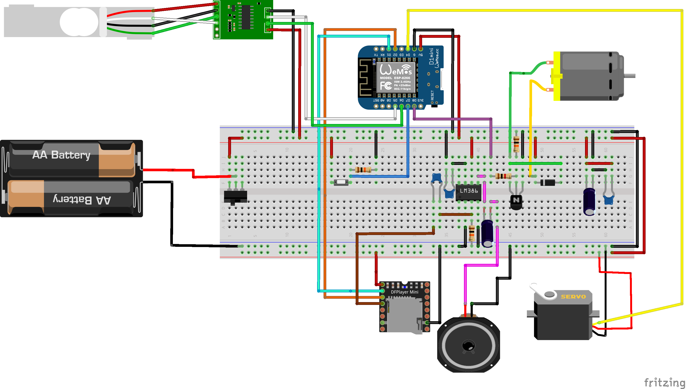
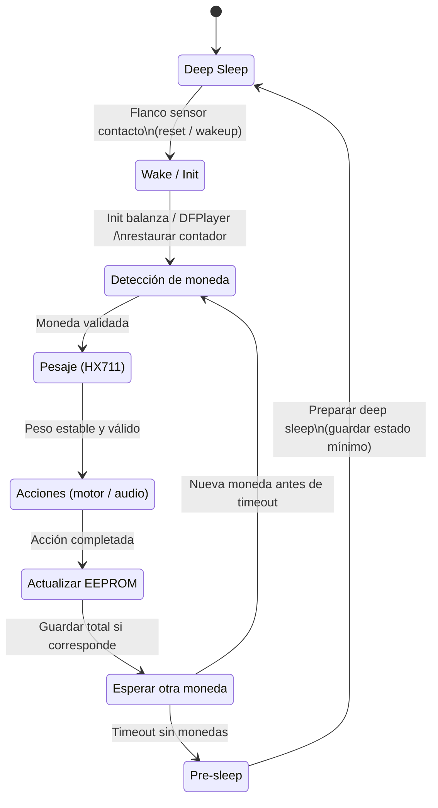

# **GimmiCoin – Alcancía Inteligente (Proyecto CE4301)**
## *Robot basado en microcontrolador – Arquitectura de Computadores I*

GimmiCoin es un robot–alcancía que detecta monedas por contacto metálico, pesa cada moneda para clasificarla, reproduce un sonido y registra el total acumulado.  
Ofrece una interfaz web embebida accesible desde cualquier teléfono mediante WiFi.

---

# **1. Propósito del Proyecto**
Este proyecto implementa un sistema embebido basado en microcontrolador que permite registrar monedas mediante:

- **Detección por contacto metálico** (flanco limpio y confiable).  
- **Pesaje preciso** mediante celda de carga + HX711.  
- **Movimiento mecánico** mediante motor DC para despejar la bandeja.  
- **Reproducción de audio** con DFPlayer Mini + parlante.  
- **Persistencia** del total mediante EEPROM.  
- **Interfaz web** en modo Access Point con página principal y panel administrativo.

El diseño físico utiliza el personaje Pokémon **Gimmighoul**, integrando electrónica, mecánica y software embebido.

---

# **2. Arquitectura General del Sistema**

Moneda → Sensor de contacto → FSM → Pesaje (HX711)
→ Motor DC (limpieza) → DFPlayer (audio)
→ EEPROM (contador) → WiFi AP → Interfaz Web

El sistema opera como access point (`SoftAP`), donde cualquier smartphone puede conectarse a la red creada por el dispositivo, visualizar el total y gestionar la alcancía.

---

# **3. Hardware Utilizado**

## 3.1 **Componentes principales**
- **Microcontrolador:** ESP8266 (D1 Mini).  
- **Sensor de moneda:** contacto metálico (pull-down externo de 10 kΩ).  
- **Pesaje:** celda de carga TAL221 + amplificador HX711.  
- **Actuador:** motor DC controlado por transistor 2N2222 + diodo flyback.  
- **Audio:** DFPlayer Mini + parlante 8Ω 0.5 W.  
- **Alimentación:** powerbank 5V.  
- **Tarjeta perforada:** montaje final obligatorio.

## 3.2 **Conexiones (resumen)**
- Sensor moneda → `D2`  
- HX711 DT / SCK → `D5 / D6`  
- Motor DC → `D8`  
- DFPlayer Mini → `D3 (TX)` y `D4 (RX con resistencia serie 1 kΩ)`  
- Powerbank 5V → Motor + DFPlayer + regulador interno 3.3V para ESP8266  

---

# **4. Diagrama Eléctrico**



---

# **5. Máquina de Estados (FSM)**



---

# **6. Persistencia**

* El total acumulado se almacena en EEPROM.
* Se escribe solo después de un **timeout de 12 s** para evitar desgaste.
* En reinicio o wake del deep sleep, el sistema restaura el total anterior.

---

# **7. Interfaz Web (HTTP sobre WiFi AP)**

## Red generada por el robot:

* **SSID:** `GimmiCoin_AP`
* **Password:** `12345678`
* **IP:** `192.168.4.1`

## Endpoints

| Ruta      | Método | Autenticación | Función                    |
| --------- | ------ | ------------- | -------------------------- |
| `/`       | GET    | No            | Página principal con total |
| `/estado` | GET    | No            | JSON con total y estado    |
| `/admin`  | GET    | Sí            | Panel administrativo       |
| `/reset`  | GET    | Sí            | Reinicia contador          |

Ejemplo `/estado`:

```json
{
  "total_crc": 350,
  "peso_ultimo": 10.1,
  "moneda_valida": true
}
```

---

# **8. Compilación y Ejecución**

## 8.1 **Requisitos**

Instalar en Arduino IDE / PlatformIO:

* ESP8266 Core
* Librerías:

  * `ESP8266WiFi.h`
  * `ESP8266WebServer.h`
  * `EEPROM.h`
  * `SoftwareSerial.h`
  * `DFRobotDFPlayerMini.h`
  * `HX711.h`

## 8.2 **Configuración**

* Placa: **Wemos D1 Mini**
* Velocidad: **80 MHz**
* Flash size: **4 MB (FS: 1 MB)**
* Baud: **115200**

## 8.3 **Ejecución**

1. Conectar la D1 mini por USB.
2. Seleccionar placa + puerto.
3. Subir firmware.
4. Desconectar USB → alimentar desde powerbank.
5. Conectarse al AP WiFi y abrir:
   [https://192.168.4.1](https://192.168.4.1)

---

# **9. Montaje Mecánico**

* Cuerpo construido como Gimmighoul.
* Bandeja de pesaje alineada con la celda TAL221.
* Motor DC fijo en canal de expulsión.
* Sensor de contacto ubicado en entrada de moneda.
* Placa perforada montada en compartimento seguro.

---

# **10. Lista de Materiales (BOM resumida)**

> Ver archivo completo en `docs/BOM.md`.

| Categoría    | Componentes                             |
| ------------ | --------------------------------------- |
| MCU          | D1 Mini ESP8266                         |
| Sensores     | Celda TAL221, HX711, sensor de contacto |
| Actuadores   | Motor DC + 2N2222 + diodo 1N4148        |
| Audio        | DFPlayer Mini + parlante                |
| Alimentación | Powerbank 5V                            |
| Estructura   | Materiales 3D o reciclados              |
| Otros        | Resistencias, cables, placa perforada   |

---

# **11. Pruebas Realizadas**

* Pruebas de detección (sensor contacto vs rebotes).
* Pruebas de pesaje y calibración.
* Pruebas motor–expulsión.
* Pruebas audio DFPlayer.
* Pruebas de integración FSM completa.
* Pruebas de interfaz web.
* Pruebas de funcionamiento alimentado por powerbank.

---
