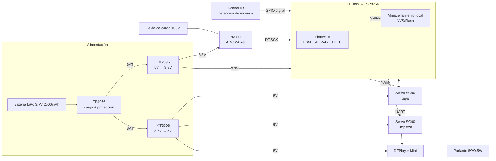
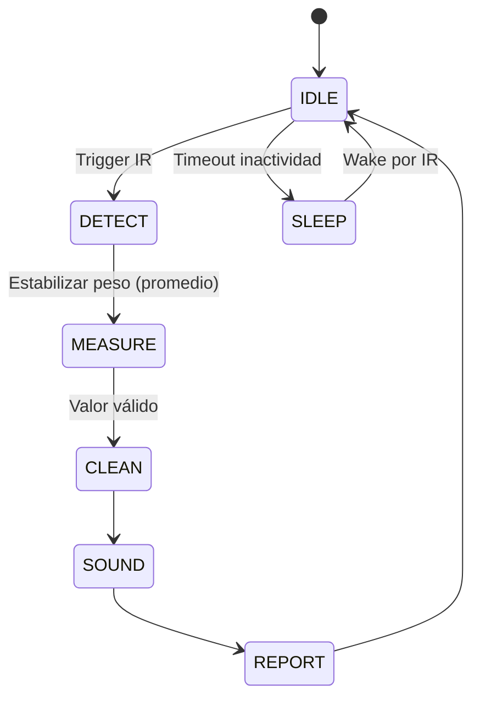
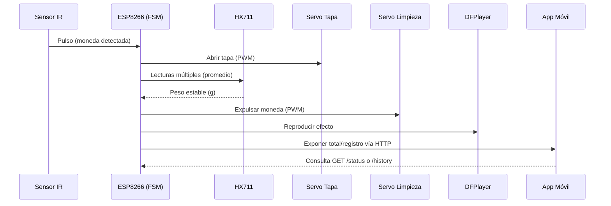

# Arquitectura de Referencia – Gimmighoul Coin Collector

**Proyecto:** Gimmighoul Coin Collector Robot  
**Curso:** CE4301 – Arquitectura de Computadores I  
**Instituto Tecnológico de Costa Rica**  
**Fecha:** Noviembre 2025  

## 1. Resumen del sistema

El sistema es una alcancía inteligente con diseño del Pokémon Gimmighoul. Al insertar una moneda:

1. Un sensor infrarrojo detecta el evento y despierta al sistema si está dormido.
2. El ESP8266 levanta la tapa (servo 1).
3. Pesa la moneda con una celda de carga (HX711).
4. Expulsa/limpia la celda (servo 2).
5. Reproduce un efecto sonoro (DFPlayer + parlante).
6. Actualiza el total y expone los datos por WiFi en modo Punto de Acceso (AP) para que la app móvil los consulte.

## 2. Justificación de decisiones de diseño

- **D1 mini ESP8266 (con WiFi integrado):** reduce tiempo de integración al traer conectividad nativa, bootloader por USB y ecosistema de librerías estable. El equipo ya tiene experiencia previa con este MCU, lo que baja el riesgo y acelera el desarrollo.
- **Clasificación por peso (celda de carga + HX711):** en Costa Rica hay monedas con **diámetros similares** (p. ej., ¢100 y ¢500; ¢25 y ¢50), lo que hace poco fiable la clasificación por “canales” o solo por tiempo de interrupción óptica. El **peso** distingue de forma robusta esos casos y evita errores de rampa/canal.

## 3. Arquitectura de alto nivel (bloques de hardware)

**Notas eléctricas:**

- Servos y DFPlayer alimentados desde **5 V** (BOOST).
- ESP8266 y HX711 desde **3.3 V** (BUCK).
- **GND común** para todos los módulos.
- Desacoplos: 470–1000 µF en 5 V; 100–220 µF en 3.3 V cerca del ESP8266.

## 4. Arquitectura de software (firmware en ESP8266)

- **Capas:**
  - Drivers: IR (GPIO/interrupt), HX711 (DT/SCK), Servos (PWM), DFPlayer (UART).
  - Servicios: Detección, Pesaje/Filtrado, Limpieza, Audio, Telemetría.
  - Aplicación: **FSM** (máquina de estados) + Exposición HTTP (modo AP).
- **Almacenamiento local:** totales y últimos eventos en **NVS/flash** del ESP8266.

### 4.1 Máquina de estados (FSM)

## 5. Arquitectura de la aplicación móvil

- **Conexión:** la app se conecta a la red **AP** creada por el ESP8266 (sin Internet).
- **Vistas principales:** Total acumulado, Historial básico (desde MCU), Ajustes mínimos.
- **Sin base de datos local:** la app muestra datos consultados al MCU y permite ajustes manuales (ej. retirar monto).

## 6. Interfaces y contratos (AP WiFi + HTTP)

- **Modo AP (Access Point):**
  - El ESP8266 crea una red local (SSID/clave configurables).
  - La app se conecta a ese AP y realiza solicitudes HTTP al **IP del ESP** (por defecto, 192.168.4.1).
  - No requiere router externo.
- **HTTP simple (ejemplos):**
  - `GET /status` → `{ fw:"1.0.0", total_crc: 1234, count: 9 }`
  - `GET /history?limit=50` → `[{ ts:"2025-11-02T20:10Z", peso_g:9.0, valor_crc:100, total_crc:1234 }, ...]`
  - `POST /adjust` → cuerpo `{ delta_crc:-100 }` (para retirar monedas de forma manual desde la app).
- **Periféricos:**
  - DFPlayer: UART 9600 bps (play/pause/volume).
  - HX711: DT/SCK (estilo SPI de 2 hilos).
  - Servos: PWM ~50 Hz.

## 7. Flujos clave (bloques)

### 7.1 Detección → Pesaje → Limpieza → Audio → Reporte

### 7.2 Gestión de energía

- **Deep Sleep** tras timeout en IDLE; **wake** por interrupción del IR.
- Antes de dormir, se sincroniza el estado mínimo necesario en NVS/flash.

## 9. Seguridad y robustez

- **Eléctrica:** protecciones del TP4056, desacoplos en 5 V/3.3 V, retornos de corriente de servos separados del plano del MCU.
- **Red:** AP con WPA2 y endpoints mínimos; validar inputs en `/adjust` para evitar montos negativos erróneos.
- **Firmware:** validación de rangos (peso, tiempos), reintentos en UART/HX711, watchdog opcional.

## 10. Rendimiento y dimensionamiento

- Latencia objetivo por ciclo completo: ≤ 4 s.
- Precisión de peso: error ≤ ±5 % tras calibración.
- Alcance WiFi interior: 5–8 m en línea de vista.
- Autonomía: según perfil de uso; mediciones documentadas en pruebas de potencia.

## 11. Trazabilidad

- **DoD:** `docs/Definition_of_Done.md`
- **Risk Assessment:** `docs/Risk_Assessment.md`
- **BOM:** `docs/BOM_AlternativaB.md`
- **Roadmap y Issues:** GitHub Projects (Sprints 0–4)

---
