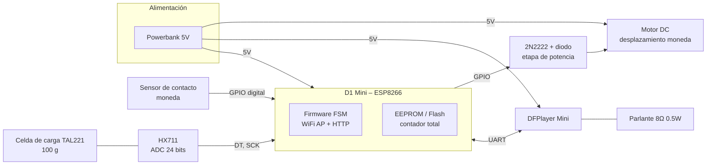
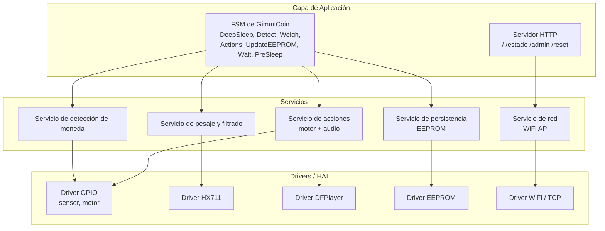
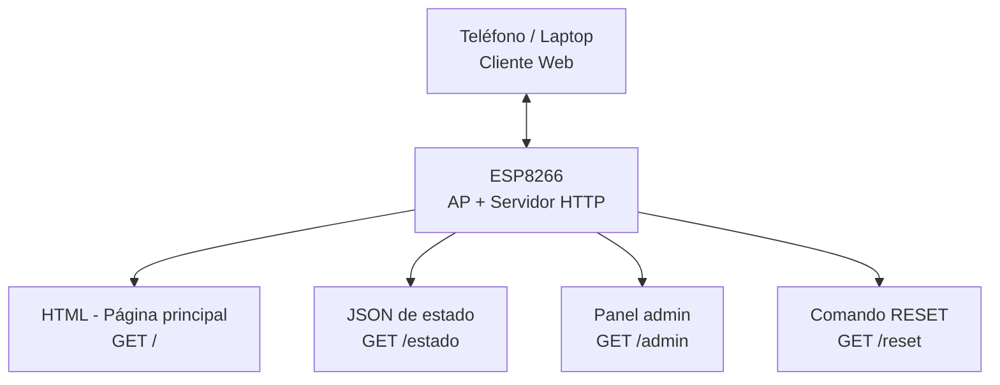
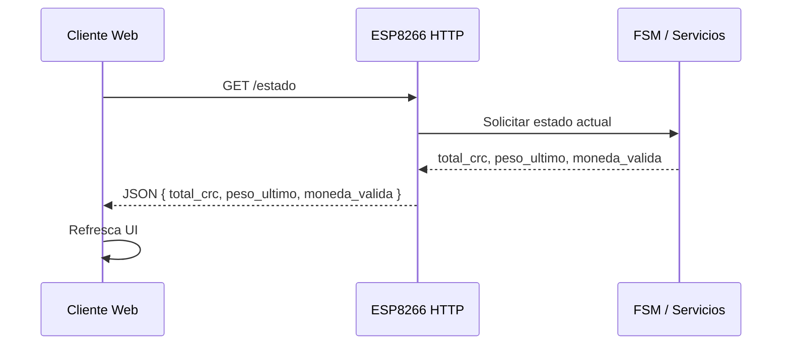
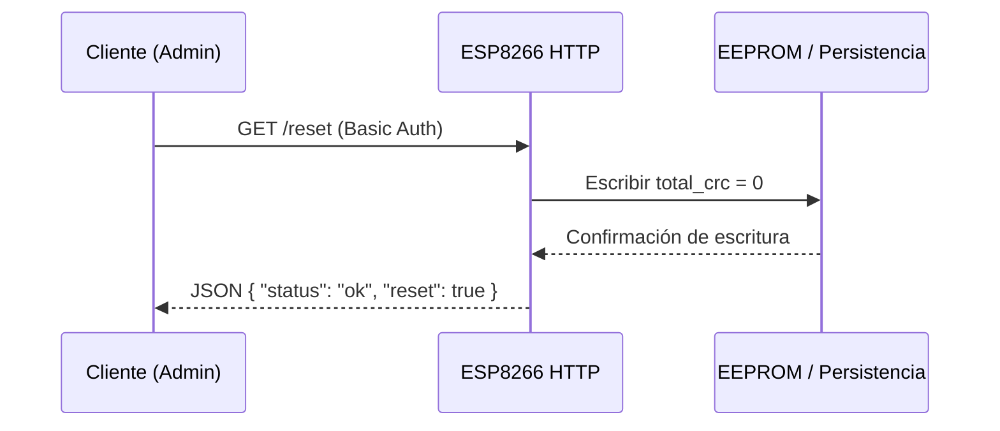
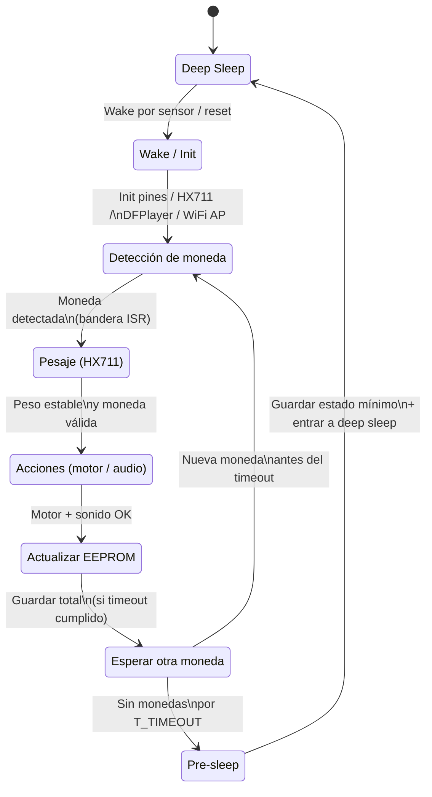

# Arquitectura de Referencia – GimmiCoin (Gimmighoul Coin Collector)

---

## 1. Resumen del Sistema

GimmiCoin es una **alcancía inteligente** basada en un microcontrolador **ESP8266 (D1 Mini)** que:

1. Detecta monedas mediante un **sensor de contacto metálico**.
2. Pesa la moneda usando una **celda de carga TAL221 + módulo HX711**.
3. Acciona un **motor DC** para desplazar la moneda fuera de la bandeja de pesaje.
4. Reproduce un sonido con un **DFPlayer Mini** + parlante.
5. Actualiza un **contador total** almacenado en EEPROM.
6. Expone el estado mediante una **aplicación web** servida por el ESP8266 en modo **Access Point (AP)**.

La arquitectura de referencia define cómo se organizan estos componentes de hardware y software, así como los flujos principales y las interfaces entre ellos.

---

## 2. Objetivos Arquitectónicos

Los principales objetivos de diseño son:

- **Simplicidad y robustez:** Minimizar la cantidad de actuadores y sensores mecánicamente complejos. Se usa un solo motor DC y un sensor de contacto simple.
- **Medición confiable:** Usar **peso** en lugar de geometría para distinguir monedas con diámetros similares.
- **Bajo acoplamiento:** Separar hardware, firmware y aplicación web en módulos bien definidos.
- **Escalabilidad:** Permitir futuras mejoras (clasificación por tipo de moneda, más vistas en la app, integración con backend externo).
- **Trazabilidad ágil:** Mantener una arquitectura que se refleje directamente en el **Product Backlog**, la **Definition of Done (DoD)** y el **Risk Assessment**.

---

## 3. Arquitectura de Hardware (Vista de Bloques)

### 3.1 Diagrama de bloques de hardware

### 3.2 Justificación de decisiones de hardware

* **Powerbank 5 V:**
  Simplifica la alimentación (no se requiere etapa LiPo + cargador + boost/buck separados). Además, las powerbanks son fáciles de recargar y proporcionan corriente suficiente para el motor y DFPlayer.

* **Sensor de contacto:**
  Es una solución simple y confiable para detectar el paso de monedas, sin necesidad de sensor IR ni óptico. Facilita el montaje mecánico y reduce costos.

* **Celda de carga + HX711:**
  Permite diferenciar monedas por peso con buena resolución. El HX711 provee una interfaz digital síncrona sencilla de manejar desde el ESP8266.

* **Motor DC + 2N2222:**
  Un solo actuador mecánico es suficiente para despejar la bandeja. La etapa de potencia con 2N2222 + diodo flyback es una solución estándar y robusta.

* **DFPlayer Mini + parlante:**
  Descentraliza el manejo de audio (el ESP8266 solo envía comandos por UART), reduciendo la carga de procesamiento y memoria del microcontrolador.

---

## 4. Arquitectura del Software Embebido

La arquitectura de software se organiza en tres capas principales:

1. **Drivers / HAL (Hardware Abstraction Layer)**
2. **Servicios de dominio (lógica de GimmiCoin)**
3. **Capa de aplicación y comunicación (FSM + HTTP)**

### 4.1 Diagrama de capas de software

### 4.2 Relación con módulos `.ino`

* `GimmiCoin_Main.ino` → FSM + inicialización.
* `GimmiCoin_SensorMoneda.ino` → parte de **DET + D_GPIO**.
* `GimmiCoin_Balanza.ino` → **WEI + D_HX**.
* `GimmiCoin_Motor.ino` → **ACT + D_GPIO**.
* `GimmiCoin_Sonido.ino` → **ACT + D_DFP**.
* `GimmiCoin_Memoria.ino` → **PERS + D_EE**.
* `GimmiCoin_Web.ino` → **HTTP + NET + D_WIFI**.

Este mapeo permite vincular directamente el **Product Backlog** con componentes arquitectónicos concretos (por ejemplo, historias de usuario para el servicio de pesaje, o para la interfaz web).

---

## 5. Arquitectura de Comunicación y Aplicación Web

El modelo de comunicación es **cliente–servidor** sobre HTTP dentro de una red local creada por el propio robot.

### 5.1 Diagrama de bloques de comunicación

### 5.2 Diagrama de secuencia – Lectura de estado

### 5.3 Diagrama de secuencia – Reset desde el panel admin

---

## 6. Máquina de Estados de Alto Nivel (FSM)

La FSM coordina el comportamiento global del sistema, integrando sensores, acciones, persistencia y deep sleep.

---

## 7. Relación con Metodología Ágil

La arquitectura de referencia sirvió como base para:

* **Product Backlog:**

  * Historias de usuario ligadas a bloques arquitectónicos:

    * HU: “Como usuario quiero ver el total ahorrado en mi teléfono” → módulo HTTP + servicios NET + PERS.
    * HU: “Como usuario quiero que la alcancía reconozca monedas automáticamente” → DET + WEI + FSM.
    * HU: “Como administrador quiero resetear el contador” → HTTP `/admin` + `/reset` + PERS.

* **Definition of Done (DoD):**

  * Cada historia de usuario se considera terminada cuando:

    * Está integrada en la FSM y en el bloque arquitectónico correspondiente.
    * Se verifican pruebas unitarias/integración sobre las rutas HTTP, pesaje, detección y motor.

* **Risk Assessment:**

  * Los riesgos críticos (por ejemplo, calibración de peso, ruido eléctrico, integración física) se mapean a componentes:

    * R9 (calibración) → bloque WEI + D_HX.
    * R2 (alimentación) → bloque PWR + MOT + DFPlayer.
    * R7 (integración física) → interacción entre hardware mecánico (LC, MOT) y comp. electrónicos.

* **Planificación por Sprints:**

  * Sprint 1: Sensado de moneda (DET), prototipo de pesaje (WEI) y servidor web mínimo.
  * Sprint 2: FSM completa, integración motor + DFPlayer (ACT).
  * Sprint 3: Deep sleep, refinamiento de UI y calibración de peso.
  * Sprint 4: Pruebas finales, documentación y video de demostración.

De esta forma, la arquitectura no es solo un diagrama estático, sino una **guía para el desarrollo ágil**, que permite priorizar, estimar esfuerzo y evaluar el progreso de forma continua.

---

## 8. Seguridad y Robustez

La arquitectura contempló desde el inicio aspectos de:

* **Seguridad eléctrica:**

  * Uso de diodo flyback en motor.
  * Desacoplo en 5 V y 3.3 V.
  * GND común y rutas separadas para señales sensibles.
* **Seguridad lógica:**

  * Autenticación básica en `/admin` y `/reset`.
  * Validación de entradas del cliente (por ejemplo, impedir montos negativos).
* **Robustez de firmware:**

  * ISR corta para el sensor de contacto.
  * Promediado de lecturas de HX711 para evitar ruido.
  * Escrituras diferidas en EEPROM para reducir desgaste.

---
